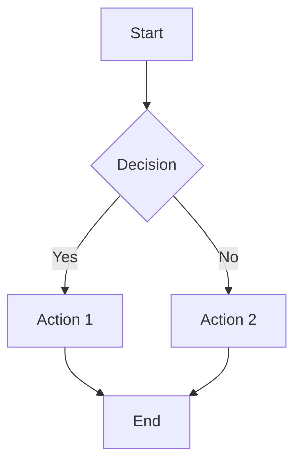
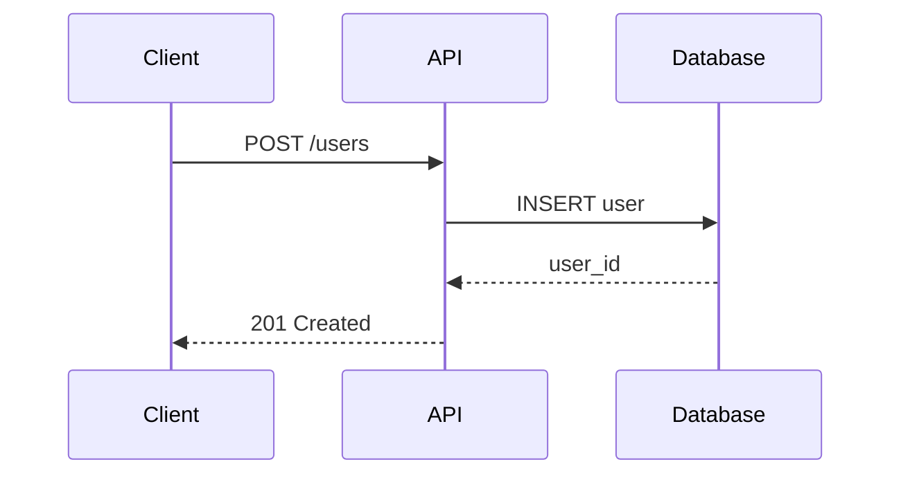
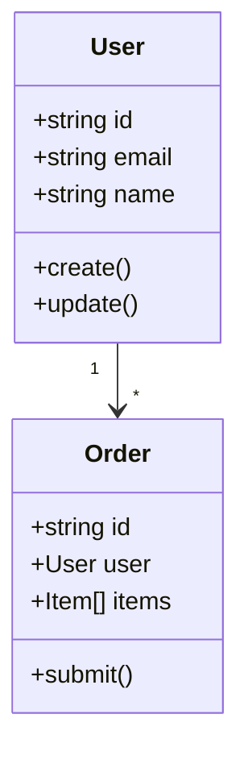
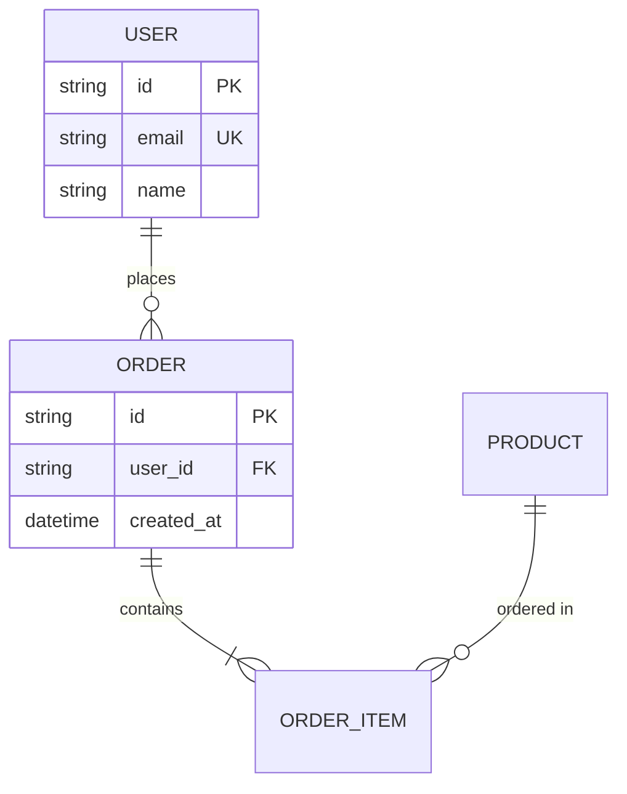
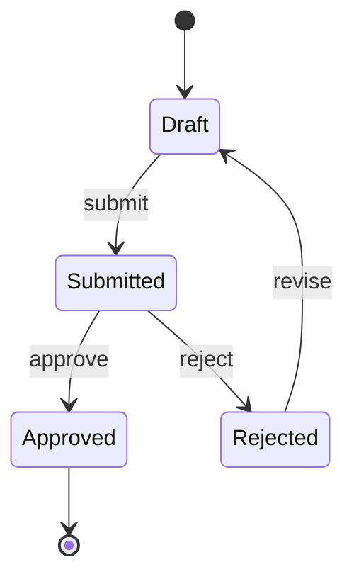

# Tech Writer Reference Guide

This document provides detailed guidance for the Tech Writer skill. Reference this for extended patterns, templates, and standards.

---

## Table of Contents

1. [Documentation Types](#documentation-types)
2. [Document Project Workflow](#document-project-workflow)
3. [Mermaid Diagram Reference](#mermaid-diagram-reference)
4. [API Documentation Standards](#api-documentation-standards)
5. [Quality Checklist](#quality-checklist)
6. [Advanced Patterns](#advanced-patterns)

---

## Documentation Types

### README

**Purpose:** First point of contact for new users/contributors

**Structure:**
```markdown
# Project Name

Brief description (1-2 sentences)

## Features

- Key feature 1
- Key feature 2

## Quick Start

1. Install: `npm install project-name`
2. Configure: Create `.env` file
3. Run: `npm start`

## Documentation

- [User Guide](docs/user-guide.md)
- [API Reference](docs/api.md)
- [Contributing](CONTRIBUTING.md)

## License

MIT License - see [LICENSE](LICENSE)
```

**Guidelines:**
- Under 500 lines (link to detailed docs)
- What, Why, How structure
- Working quick start example
- Clear navigation to detailed docs

### API Reference

**Purpose:** Complete endpoint documentation for API consumers

**Required Elements:**
- Endpoint path and method
- Authentication requirements
- Request parameters (path, query, body) with types
- Request example (realistic, working)
- Response schema with types
- Response examples (success + common errors)
- Error codes and meanings
- Rate limits if applicable

**Example:**
```markdown
## Create User

Creates a new user account.

### Request

`POST /api/v1/users`

**Authentication:** Bearer token required

**Body:**
| Field | Type | Required | Description |
|-------|------|----------|-------------|
| email | string | Yes | Valid email address |
| password | string | Yes | Min 8 characters |
| name | string | No | Display name |

**Example:**
```json
{
  "email": "user@example.com",
  "password": "securePassword123",
  "name": "John Doe"
}
```

### Response

**Success (201 Created):**
```json
{
  "id": "usr_abc123",
  "email": "user@example.com",
  "name": "John Doe",
  "createdAt": "2026-01-18T12:00:00Z"
}
```

**Errors:**
| Code | Description |
|------|-------------|
| 400 | Invalid request body |
| 409 | Email already exists |
| 500 | Internal server error |
```

### User Guide

**Purpose:** Task-based instructions for end users

**Structure:**
- Organized by user goals (How to...)
- Step-by-step instructions
- Screenshots/diagrams where helpful
- Troubleshooting section

**Example Sections:**
```markdown
## Getting Started

### How to Create Your First Project

1. Log in to your dashboard
2. Click **New Project** in the top-right corner
3. Enter a project name and description
4. Select your project template
5. Click **Create**

Your project is now ready. See [Adding Team Members](#adding-team-members) to invite collaborators.

### How to Configure Settings

...

## Troubleshooting

### "Permission Denied" Error

This error occurs when you don't have access to a resource.

**Solution:**
1. Verify you're logged into the correct account
2. Check your role permissions with your administrator
3. Request access through the Team Settings page
```

### Architecture Documentation

**Purpose:** System overview for technical stakeholders

**Required Elements:**
- System overview diagram (Mermaid)
- Component descriptions
- Data flow
- Technology decisions (ADRs)
- Deployment architecture
- Integration points

**Structure:**
```markdown
# System Architecture

## Overview

[Brief description + Mermaid diagram]

## Components

### API Gateway
- **Purpose:** Request routing and authentication
- **Technology:** Express.js
- **Scaling:** Horizontal, behind load balancer

### User Service
- **Purpose:** User management and authentication
- **Technology:** Node.js + PostgreSQL
- **Dependencies:** Email service, Cache layer

## Data Flow

[Mermaid sequence diagram]

## Technology Decisions

### ADR-001: Database Selection

**Context:** Need persistent storage for user data
**Decision:** PostgreSQL
**Rationale:** ACID compliance, JSON support, team expertise
**Consequences:** Requires managed service for production
```

---

## Document Project Workflow

### Phase 1: Discovery

1. **Scan Project Structure**
   ```bash
   # Generate directory tree
   find . -type f -name "*.ts" -o -name "*.js" -o -name "*.py" | head -100
   ```

2. **Identify Project Type**
   - Check `package.json`, `requirements.txt`, `go.mod`, etc.
   - Identify framework (React, Express, Django, etc.)
   - Note build tools and test frameworks

3. **Locate Key Files**
   - Entry points (`index.ts`, `main.py`, `app.go`)
   - Configuration files
   - Existing documentation
   - Test files (indicate code structure)

### Phase 2: Analysis

1. **Architecture Pattern**
   - Monolith vs microservices
   - Layered vs modular
   - Event-driven vs request-response

2. **Key Components**
   - Core modules/packages
   - External integrations
   - Database/storage layer
   - API layer

3. **Data Flow**
   - Entry points (HTTP, CLI, events)
   - Processing layers
   - Exit points (responses, files, messages)

### Phase 3: Documentation Generation

1. **Project Overview**
   - Use `templates/project-overview.template.md`
   - Fill in discovered information
   - Generate architecture Mermaid diagram

2. **Source Tree**
   - Annotate each major directory
   - Explain file naming conventions
   - Note configuration files

3. **Component Documentation**
   - For each major component:
     - Purpose and responsibility
     - Key files and functions
     - Dependencies
     - Usage examples

### Phase 4: Validation

1. **Technical Accuracy**
   - Code references are correct
   - Examples actually work
   - Dependencies are current

2. **Standards Compliance**
   - CommonMark valid
   - No time estimates
   - Accessibility standards met

---

## Mermaid Diagram Reference

### Flowchart



**Best Practices:**
- Use TD (top-down) or LR (left-right)
- Clear, descriptive labels
- Limit to 10-15 nodes
- Use subgraphs for grouping

### Sequence Diagram



**Best Practices:**
- Name participants clearly
- Show request/response pairs
- Include error flows
- Use notes for clarification

### Class Diagram



### ER Diagram



### State Diagram



---

## API Documentation Standards

### OpenAPI Compliance

When documenting APIs, follow OpenAPI 3.0+ conventions:

```yaml
openapi: 3.0.0
info:
  title: API Name
  version: 1.0.0
  description: API description

paths:
  /users:
    post:
      summary: Create user
      requestBody:
        required: true
        content:
          application/json:
            schema:
              $ref: '#/components/schemas/CreateUserRequest'
      responses:
        '201':
          description: User created
          content:
            application/json:
              schema:
                $ref: '#/components/schemas/User'
```

### Documentation Sections

1. **Overview**
   - Base URL
   - Authentication methods
   - Rate limits
   - Versioning strategy

2. **Authentication**
   - Supported methods (API key, OAuth, JWT)
   - How to obtain credentials
   - Header/parameter formats
   - Example authenticated request

3. **Endpoints**
   - Grouped by resource
   - Complete request/response docs
   - Working examples
   - Error responses

4. **Errors**
   - Standard error format
   - Error code reference
   - Troubleshooting common errors

---

## Quality Checklist

Before finalizing ANY documentation:

### CommonMark Compliance
- [ ] ATX-style headers only (`#`, not underlines)
- [ ] Single space after `#`
- [ ] Headers in proper hierarchy (no skipped levels)
- [ ] Fenced code blocks with language tags
- [ ] Consistent list markers
- [ ] Proper link syntax

### Content Quality
- [ ] NO time estimates anywhere
- [ ] Active voice, present tense
- [ ] Task-oriented (answers "how do I...")
- [ ] Examples are concrete and working
- [ ] Spelling and grammar checked
- [ ] Reads clearly at target skill level

### Accessibility
- [ ] Descriptive link text (not "click here")
- [ ] Alt text for images/diagrams
- [ ] Tables have headers
- [ ] Semantic heading hierarchy

### Technical Accuracy
- [ ] Code examples tested
- [ ] Links verified working
- [ ] Version numbers current
- [ ] Dependencies accurate

---

## Advanced Patterns

### Progressive Disclosure

For complex documentation, use progressive disclosure:

1. **Overview** (1 minute read)
   - What it is
   - Key benefits
   - Quick example

2. **Getting Started** (5 minute read)
   - Installation
   - Basic usage
   - First success

3. **Guide** (reference as needed)
   - Detailed features
   - Advanced configuration
   - Integration patterns

4. **Reference** (lookup)
   - Complete API reference
   - Configuration options
   - Error codes

### Documentation as Code

Treat documentation like code:

- Version control with git
- Review changes via PRs
- Automated validation (lint, link check)
- CI/CD for publishing
- Issue tracking for docs bugs

### Multi-Audience Documentation

When documenting for multiple audiences:

```markdown
## Quick Start

[For all users - 5 minute setup]

## User Guide

[For end users - task-based instructions]

## Developer Guide

[For developers - integration and extension]

## Administrator Guide

[For ops - deployment and maintenance]
```

---

## BMAD Integration

### Cross-Phase Documentation

The Tech Writer skill integrates with other BMAD phases:

| Phase | Documentation Role |
|-------|-------------------|
| Analysis | Document research findings |
| Planning | Format PRD, requirements |
| Solutioning | Architecture documentation |
| Implementation | API docs, user guides |

### Workflow Status Integration

When running `/document-project`:
1. Check for existing `bmm-workflow-status.yaml`
2. Update documentation phase status
3. Link generated docs in workflow status

### Beads Integration

Documentation tasks can be tracked in beads:
- `bd create "Document API endpoints" -l "bmad:doc"`
- Use `/ready-work` to see documentation tasks
- Close issues when docs are complete

---

*Reference document for Tech Writer skill. See SKILL.md for quick reference.*
